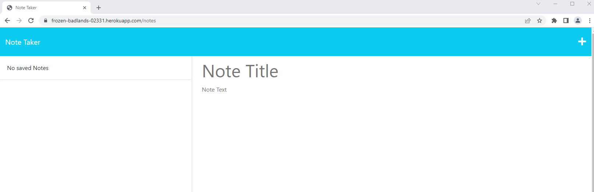

# Note Taker

## Task

The task is to create an application called Note Taker that can be used to write and save notes. This application will use an Express.js back end and will save and retrieve note data from a JSON file.

This application is deployed to Heroku.


## User Story

```
AS A small business owner
I WANT to be able to write and save notes
SO THAT I can organize my thoughts and keep track of tasks I need to complete
```


## Acceptance Criteria

```
GIVEN a note-taking application
WHEN I open the Note Taker
THEN I am presented with a landing page with a link to a notes page
WHEN I click on the link to the notes page
THEN I am presented with a page with existing notes listed in the left-hand column, plus empty fields to enter a new note title and the note’s text in the right-hand column
WHEN I enter a new note title and the note’s text
THEN a Save icon appears in the navigation at the top of the page
WHEN I click on the Save icon
THEN the new note I have entered is saved and appears in the left-hand column with the other existing notes
WHEN I click on an existing note in the list in the left-hand column
THEN that note appears in the right-hand column
WHEN I click on the Write icon in the navigation at the top of the page
THEN I am presented with empty fields to enter a new note title and the note’s text in the right-hand column
```


## Description

 * Deployed Link to Heroku: https://frozen-badlands-02331.herokuapp.com


 When the page is opened, user can see the main page Note Taker. Clicking 'Get Started' will bring it to note taking page. 




User can take note(s) on this page and save it/them. (User must fill out both title and text in order to save the note.)


Once it got saved, user can see thier notes or can delete them from left column of the page.

User can create new note by clicking plus icon on the right top of the page.
 

## How to Use

 * Go to page 'https://frozen-badlands-02331.herokuapp.com' (The app is deployed to Heroku.)
 
 * (If user wants to use the page with localhost, use
    
    ```bash
      npm start
    ```
    run the app and use http://localhost:3001 )

 * User must fill out both Title and Text in order to save the note. Saved note(s) will be displayed and accessible on the left side of the page.

 * User can delete the note by clicking trash bin icon next to saved note(s).

 * Click plus(+) icon to create new note. 


## Credits
* [Express.js npm pakage](https://www.npmjs.com/package/express)
* [uid function used for this app (for unique id generator)](https://www.npmjs.com/package/short-unique-id)
* How to handle 'DELETE' request, referenced from: https://www.tabnine.com/code/javascript/functions/express/Express/delete

- - -
© 2023 edX Boot Camps LLC. Confidential and Proprietary. All Rights Reserved.
